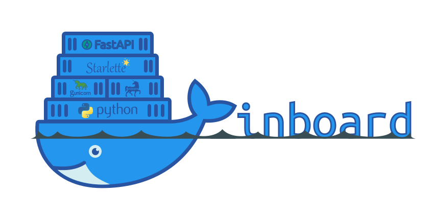

# 🚢 inboard 🐳



_Docker images and utilities to power your Python APIs and help you ship faster._

[](https://pypi.org/project/inboard/)
[](https://github.com/br3ndonland/inboard/pkgs/container/inboard)
[](https://coverage.readthedocs.io/en/latest/)
[](https://github.com/br3ndonland/inboard/actions)
[](https://github.com/astral-sh/ruff)

[](https://github.com/mjhea0/awesome-fastapi)

## Description

This project provides [Docker images](https://github.com/br3ndonland/inboard/pkgs/container/inboard) and a [PyPI package](https://pypi.org/project/inboard/) with useful utilities for Python web servers. It runs [Uvicorn with Gunicorn](https://www.uvicorn.org/), and can be used to build applications with [Starlette](https://www.starlette.io/) and [FastAPI](https://fastapi.tiangolo.com/).

## Justification

_Why use this project?_ You might want to try out inboard because it:

- **Offers a Python package and Docker images that work together**. Python packages and Docker images don't automatically share the same versioning systems, but inboard can help with this. You might install the Python package with a minor version constraint. You can also pull the corresponding Docker image by specifying the minor version in the Docker tag (`FROM ghcr.io/br3ndonland/inboard:<version>`).
- **Tests everything**. inboard performs unit testing of 100% of the Python code, and also runs smoke tests of the Docker images each time they are built.
- **Sets sane defaults, but allows configuration**. Configure a variety of settings with [environment variables](environment.md). Or run it as-is and it just works.
- **Configures logging extensibly**. [inboard simplifies logging](logging.md) by handling all its Python log streams with a single logging config. It also offers the ability to [filter health check endpoints out of the access logs](logging.md#filtering-log-messages). Don't like it? No problem. You can easily [extend](logging.md#extending-the-logging-config) or [override](logging.md#overriding-the-logging-config) the logging behavior.

## Quickstart

[Get started with Docker](https://www.docker.com/get-started), pull and run an image, and try an API endpoint.

```sh
docker pull ghcr.io/br3ndonland/inboard
docker run -d -p 80:80 --platform linux/amd64 ghcr.io/br3ndonland/inboard
http :80  # HTTPie: https://httpie.io/
```

## Background

**I built this project to use as a production Python web server layer.** I was working on several different software applications, and wanted a way to centrally manage the web server layer, so I didn't have to configure the server separately for each application. I also found it difficult to keep up with all the changes to the associated Python packages, including Uvicorn, Starlette, and FastAPI. I realized that I needed to abstract the web server layer into a separate project, so that when working on software applications, I could simply focus on building the applications themselves. This project is the result. It's been very helpful to me, and I hope it's helpful to you also.

This project was inspired in part by [tiangolo/uvicorn-gunicorn-docker](https://github.com/tiangolo/uvicorn-gunicorn-docker). In addition to the benefits described in the [justification section](#justification), inboard also has the following advantages:

- **One repo**. The tiangolo/uvicorn-gunicorn images are in at least three separate repos ([tiangolo/uvicorn-gunicorn-docker](https://github.com/tiangolo/uvicorn-gunicorn-docker), [tiangolo/uvicorn-gunicorn-fastapi-docker](https://github.com/tiangolo/uvicorn-gunicorn-fastapi-docker), and [tiangolo/uvicorn-gunicorn-starlette-docker](https://github.com/tiangolo/uvicorn-gunicorn-starlette-docker)), with large amounts of code duplication, making maintenance difficult for an [already-busy maintainer](https://github.com/encode/uvicorn/pull/705#issuecomment-660042305). This repo combines three into one.
- **One _Dockerfile_.** This project leverages [multi-stage builds](https://docs.docker.com/build/building/multi-stage/) to produce multiple Docker images from one _Dockerfile_.
- **One Python requirements file.** This project uses [Hatch](https://hatch.pypa.io/latest/) for dependency management with a single _pyproject.toml_.
- **One logging configuration.** Logging a Uvicorn+Gunicorn+Starlette/FastAPI stack is unnecessarily complicated. Uvicorn and Gunicorn use different logging configurations, and it can be difficult to unify the log streams. In this repo, Uvicorn, Gunicorn, and FastAPI log streams are propagated to the root logger, and handled by the custom root logging config. Developers can also supply their own custom logging configurations.
- **One programming language.** Pure Python with no shell scripts.
- **One platform.** You're already on GitHub. Why not [pull Docker images from GitHub Container Registry](https://github.blog/2020-09-01-introducing-github-container-registry/)?

The PyPI package is useful if you want to use or extend any of the inboard Python modules, such as the logging configuration.
